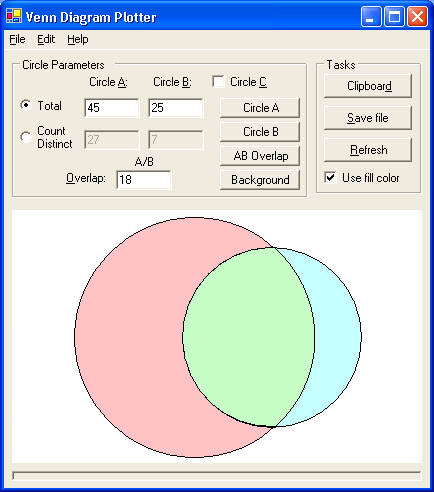
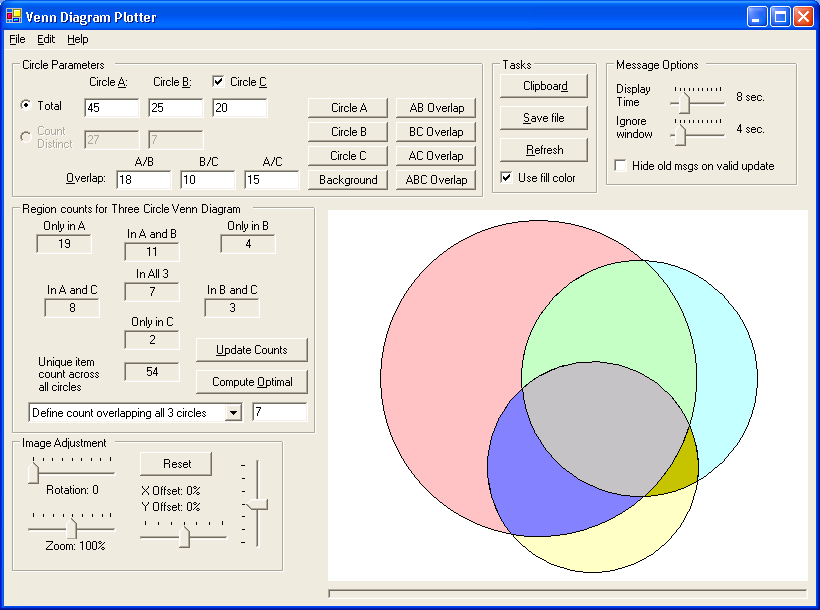
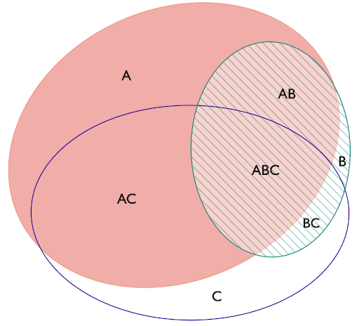
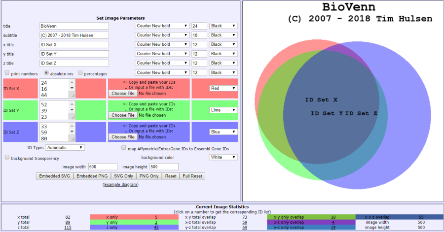

# __Venn Diagram Plotter__
VIPER (Visual Inspection of Peak/Elution Relationships) can be used to visualize and characterize the features detected during LC-MS analyses.

### Description
This program can draw correctly proportioned and positioned Venn diagrams, supporting both two-circle and three-circle Venn diagrams (though the overlap regions of three-circle Venn diagrams are not always to scale). A Venn diagram (aka Euler diagram) is a method of visualizing the amount of overlap between two (or three) lists of data, using circles to signify the size of each circle and positioning the circles such that the area of overlap represents the amount of list overlap.

The program includes a graphical user interface (GUI) where the user enters sizes and amount of overlap between the two (or three) lists (the overlap must be determined separately by the user). The resultant Venn diagrams are displayed, the colors can be customized, and the diagrams can be copied to the clipboard or saved to disk.

### Downloads
* [Latest version](https://github.com/PNNL-Comp-Mass-Spec/Venn-Diagram-Plotter/releases/latest)
* [Source code on GitHub](https://github.com/PNNL-Comp-Mass-Spec/Venn-Diagram-Plotter)

#### Software Instructions
##### 2-circle Venn Diagram

##### 2-circle Venn Diagram

##### Externally Developed Software
Luana Micallef has developed an improved 3-circle Venn diagram program that uses ellipses instead of circles, leading to more accurate representations of area-proportional overlap. For more information, see the [eulerAPE website](http://www.eulerdiagrams.org/eulerAPE/) at [http://www.eulerdiagrams.org/eulerAPE/](http://www.eulerdiagrams.org/eulerAPE/)

Another online tool is BioVenn, developed by Tim Hulsen, and available at http://www.biovenn.nl  

### Acknowledgment

All publications that utilize this software should provide appropriate acknowledgement to PNNL and the Venn-Diagram-Plotter GitHub repository. However, if the software is extended or modified, then any subsequent publications should include a more extensive statement, as shown in the Readme file for the given application or on the website that more fully describes the application.

### Disclaimer

These programs are primarily designed to run on Windows machines. Please use them at your own risk. This material was prepared as an account of work sponsored by an agency of the United States Government. Neither the United States Government nor the United States Department of Energy, nor Battelle, nor any of their employees, makes any warranty, express or implied, or assumes any legal liability or responsibility for the accuracy, completeness, or usefulness or any information, apparatus, product, or process disclosed, or represents that its use would not infringe privately owned rights.

Portions of this research were supported by the NIH National Center for Research Resources (Grant RR018522), the W.R. Wiley Environmental Molecular Science Laboratory (a national scientific user facility sponsored by the U.S. Department of Energy's Office of Biological and Environmental Research and located at PNNL), and the National Institute of Allergy and Infectious Diseases (NIH/DHHS through interagency agreement Y1-AI-4894-01). PNNL is operated by Battelle Memorial Institute for the U.S. Department of Energy under contract DE-AC05-76RL0 1830.

We would like your feedback about the usefulness of the tools and information provided by the Resource. Your suggestions on how to increase their value to you will be appreciated. Please e-mail any comments to proteomics@pnl.gov
